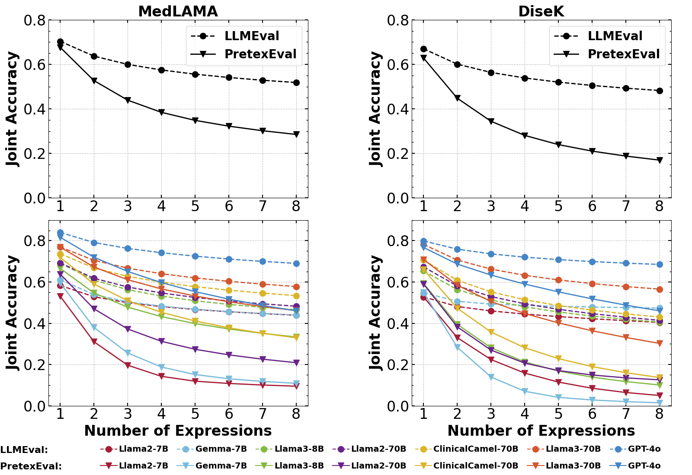

# PretexEval
Codes and datasets of the ICLR 2025 paper: Reliable and Diverse Evaluation of LLM Medical Knowledge Mastery 
## Introduction
PretexEval is an evaluation framework that dynamically generates reliable and diverse test samples to evaluate LLMs for any given medical knowledge base. This framework employs predicate equivalence transformations to produce a series of variants for any given medical knowledge point. Finally, these produced predicate variants are converted into textual language, resulting in a series of reliable and diverse test samples for LLM evaluation. We use PretexEval to systematically investigate the mastery of medical factual knowledge of 12 well-known LLMs. The evaluation results illustrate that current LLMs still exhibit significant deficiencies in fully mastering medical knowledge, despite achieving considerable success on some famous public benchmarks. 


## Hardware Requirements
```
transformers 4.47.0
torch 2.5.1
vllm 0.6.6
tqdm 4.67.1
pandas 2.2.3
```
## Generate Evaluation Set with PretexEval based on MedLAMA Knowledge Base
### 1. Predicate Transformation
PretexEval leverages predicate equivalent transformations to generate predicate variants from the original knowledge expression. These predicate variants are mapped to corresponding prototypes (i.e. textual templates) for generating test samples. You can find the prototypes we use in `medlama/data/medlama/prompts_pretex.csv`.
### 2. Prototype Instantiation
To generate instantiated prototypes based on the MedLAMA knowledge base, simply run
```
python prototype_instantiation.py
```
The command above generates two file `medlamatf_dev.json` and `medlamatf_test.jsonl` in the `data` folder.
### 3. Test Sample Generation
Test samples are generated by rephrasing the instantiated prototypes using an LLM. To generate the final test samples, run
```
python prototype_rephrase.py
```
You should replace `model_name` and `model_path` with the LLM you choose as the rephrasing LLM. In our implementation, we use `Llama-3-70B-Instruct` since it presents strong performance in various general NLP tasks.
## Evaluation
To run evaluation based on the generated dataset, run
```
python eval_medlama.py --model [model_path] --model_name [model_name] --num_cuda [NUM_GPUS]
```
where `[model_path]` and `[model_name]` are the path and name of your evaluated LLM. `[NUM_GPUS]` is the number of GPUs you choose to use for evaluation.
## Results Parsing and Scoring
To be released soon.